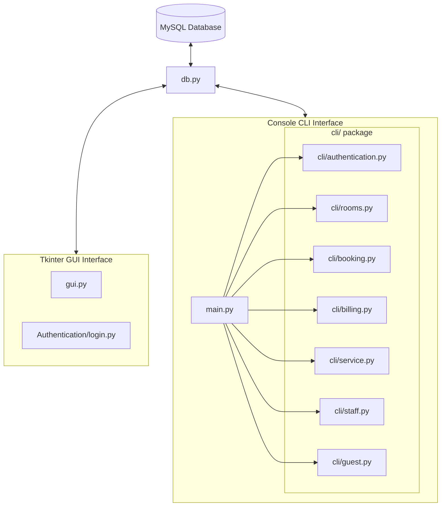

# Hotel Management System (HMS) - Project Description

The **Hotel Management System (HMS)** is a dual-interface application (supporting both a Command Line Interface (CLI) and a Graphical User Interface (GUI)) powered by Python and MySQL. It is designed to manage hotel operations including room management, bookings, guest check-ins/check-outs, billing/payment processing, service requests, and staff/housekeeping management.

The system enforces role-based access control (RBAC) for three primary roles: **Admin**, **Manager**, and **Receptionist**.

---

## 🏗️ Project Architecture

### Key Integration Strategy in `main.py`
[main.py](file:///d:/HMS_Project/main.py) imports all business-logic modules from the structured `cli/` package. Each module in `cli/` is a clean, self-contained Python module with all interactive menus guarded by `if __name__ == "__main__":`, eliminating the need for the AST loader that was used with the original teammate drafts.

---

## 🗃️ Database Schema

The database relies on a shared connection configuration defined in [db.py](file:///d:/HMS_Project/db.py). The schema contains the following primary tables:

1. **`users`**: System login credentials.
   * `user_id` (INT, Primary Key)
   * `username` (VARCHAR)
   * `password` (VARCHAR - plaintext or hashed)
   * `role` (ENUM: `'Admin'`, `'Manager'`, `'Receptionist'`)
   * `last_login`, `created_at` (TIMESTAMPS)
2. **`rooms`**: Hotel rooms inventory.
   * `room_id` (INT, Primary Key)
   * `room_number` (VARCHAR)
   * `room_type` (ENUM: `'Single'`, `'Double'`, `'Deluxe'`, `'Suite'`)
   * `price_per_night` (DECIMAL)
   * `status` (ENUM: `'Available'`, `'Booked'`, `'Maintenance'`)
3. **`bookings`**: Room booking and guest state records.
   * `booking_id` (INT, Primary Key)
   * `guest_name`, `guest_id` (VARCHAR)
   * `room_id` (INT)
   * `check_in`, `check_out` (DATE)
   * `adults`, `children` (INT)
   * `booking_status` (ENUM: `'Confirmed'`, `'Checked In'`, `'Checked Out'`, `'Cancelled'`)
4. **`billing`**: Invoice details.
   * `bill_id` (INT, Primary Key)
   * `booking_id` (INT)
   * `room_charges`, `extra_charges`, `total_amount` (DECIMAL)
   * `payment_method` (VARCHAR: `'Cash'`, `'Card'`, `'UPI'`)
   * `payment_status` (ENUM: `'Pending'`, `'Paid'`)
   * `bill_date` (DATE)
5. **`service_requests`**: Guest amenity and utility requests.
   * `request_id` (INT, Primary Key)
   * `booking_id` (INT)
   * `service_type` (VARCHAR)
   * `details` (TEXT)
   * `status` (ENUM: `'Pending'`, `'In Progress'`, `'Completed'`, `'Cancelled'`)
6. **`staff`**: Employee metadata.
   * `staff_id` (INT, Primary Key)
   * `full_name`, `designation`, `phone`, `email` (VARCHAR)
   * `salary` (DECIMAL)
   * `joining_date` (DATE)
7. **`housekeeping`**: Cleaning/maintenance assignments.
   * `room_no` (VARCHAR, Unique Key)
   * `assigned_staff` (VARCHAR)
   * `status` (ENUM: `'Clean'`, `'Dirty'`, `'In Progress'`)

---

## 📁 File Structure & Component Map

* **📁 Root Directory**:
  * **[main.py](file:///d:/HMS_Project/main.py)**: Central entry point for CLI. Handles login, email receipts, and role-based menus by delegating to `cli/` modules.
  * **[db.py](file:///d:/HMS_Project/db.py)**: Shared MySQL connection module.
  * **[gui.py](file:///d:/HMS_Project/gui.py)**: Complete, multi-tab Tkinter interface matching the database operations.
  * **[guest.py](file:///d:/HMS_Project/guest.py)**: Guest CRUD module (standalone/reference).
  * **[reports.py](file:///d:/HMS_Project/reports.py)**: Analytics and chart generation (matplotlib).
  * **[check_db.py](file:///d:/HMS_Project/check_db.py)**: Diagnostic tool for DB schema inspection.

* **📁 `cli/` Package** — All CLI business-logic modules:
  * **[cli/authentication.py](file:///d:/HMS_Project/cli/authentication.py)**: Login with role-based password verification.
  * **[cli/rooms.py](file:///d:/HMS_Project/cli/rooms.py)**: Room catalog CRUD operations.
  * **[cli/booking.py](file:///d:/HMS_Project/cli/booking.py)**: Room booking, check-in, and check-out flows.
  * **[cli/billing.py](file:///d:/HMS_Project/cli/billing.py)**: Billing, payment processing, and PDF receipt generation.
  * **[cli/service.py](file:///d:/HMS_Project/cli/service.py)**: Service request administration.
  * **[cli/staff.py](file:///d:/HMS_Project/cli/staff.py)**: Employee directory and housekeeping management.
  * **[cli/guest.py](file:///d:/HMS_Project/cli/guest.py)**: Guest CRUD for CLI (self-contained, no circular imports).

* **📁 `legacy/`** — Archived original draft files (reference only, not imported).

* **📁 `Authentication/`** *(inside Hotel_Manegement_System — GUI auth)*:
  * **[Authentication/auth.py](file:///d:/HMS_Project/Hotel_Manegement_System/Authentication/auth.py)**: Session and bcrypt authentication layer.
  * **[Authentication/login.py](file:///d:/HMS_Project/Hotel_Manegement_System/Authentication/login.py)**: GUI Login Window.
  * **[Authentication/session.py](file:///d:/HMS_Project/Hotel_Manegement_System/Authentication/session.py)**: Tracks authenticated session state.

---

## 🔐 Role and Access Map

| Module Feature | Receptionist | Manager | Admin |
| :--- | :---: | :---: | :---: |
| **Room Management: View & Search** | Yes | Yes | Yes |
| **Room Management: Add & Update** | No | Yes | Yes |
| **Room Management: Delete** | No | No | Yes |
| **Booking: Create, Cancel, Modify, Check-in/out** | Yes | Yes | Yes |
| **Billing: Create, View, Search, Pay** | Yes | Yes | Yes |
| **Billing: Update** | No | Yes | Yes |
| **Billing: Delete** | No | No | Yes |
| **Service Requests: Add, View, Update** | Yes | Yes | Yes |
| **Service Requests: Delete** | No | No | Yes |
| **Staff & Housekeeping: View, Assign** | No | Yes | Yes |
| **Staff: Add, Update, Delete** | No | No | Yes |
